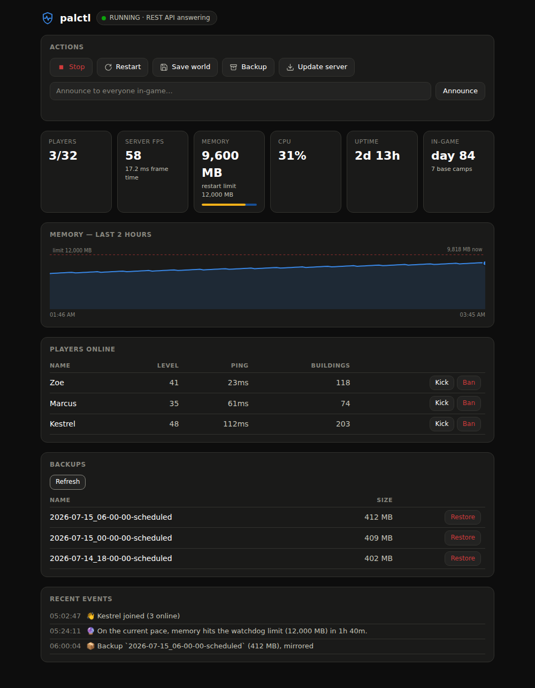
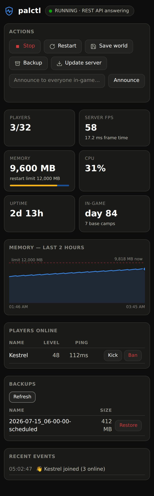

# palctl

Palworld dedicated server control for Windows. **REST-native**, with a real
memory-leak watchdog and a **self-hosted Discord bot**.

> **Status:** released and in active development — installers for every version
> are on the [Releases page](https://github.com/SteveWeed79/palctl/releases),
> with the history in [CHANGELOG.md](CHANGELOG.md). Issues and PRs welcome.

<p align="center">
  
</p>
<p align="center">
  
</p>
<p align="center"><em>The web dashboard (<code>palctl ui</code>) — desktop and phone, dark mode.</em></p>

---

## Why this exists

There are already several good Palworld server managers. This one is different in
three specific ways:

**1. It uses the REST API, not RCON.**
RCON is deprecated. Pocketpair's recommended admin interface is the REST API, and
every other Windows GUI I could find still drives RCON. REST also gives us things
RCON simply cannot: server FPS, frame time, uptime, base-camp count, and
per-player level, ping, location, and building count.

**2. It restarts on the symptom, not the clock.**
Palworld's dedicated server leaks memory. The universal advice is "restart it on a
timer," which either kicks people for no reason or leaves the server a slideshow
for hours. `palctl` reads `PalServer-Win64-Shipping.exe`'s actual resident memory
from the OS and restarts when it's *actually* bloating — with a countdown, a world
save, and a hold-off while players are online (up to a hard limit, past which the
server is going to die anyway).

You cannot do this from a web panel or a cloud bridge. You have to be *on the box*.

**3. The Discord bot is yours.**
Your token, your machine, no subscription, no third-party bridge holding your
server's admin password.

---

## Two processes

```
palctl.daemon   headless, runs as a service, always running
                → polls, diffs, watches memory, schedules, runs the Discord bot

palctl.gui      PySide6 window, open it when you want it
                → dashboard, players, console, settings editor
```

**Closing the GUI does not stop anything.** The daemon is what manages the server.
That split is deliberate: a GUI alone only helps when you're sitting at the server
PC, which is the situation most people are trying to get out of.

---

## What it does

**Daemon**
- Memory-leak watchdog (consecutive-sample confirmation, player hold-off, hard limit, cooldown)
- Leak **forecasting**: fits the actual memory growth curve and warns *before*
  the limit — and, opt-in, restarts early at a moment the server happens to be
  empty, instead of at the threshold later with players mid-session
- Scheduled restarts with in-game countdown, autosave, and rotating **local
  backups that always run, at least once a day** (pick any more-frequent
  cadence) — **consistency-checked** (a copy the server wrote through is retried,
  and flagged if it stays dirty). Turn on an optional **off-site copy** to a
  second disk, a network share, or an **rclone cloud remote** (Google Drive,
  Dropbox, S3, OneDrive …) — backups on the server's own disk don't survive the
  disk, and a house fire takes the network share with it
- Opt-in scheduled auto-update (Palworld patches constantly) — the same
  save → backup → SteamCMD → restart flow as a manual update, world backup
  included (updates are exactly when saves get eaten), and **no backup means
  no update** unless you opt out
- One **operation lock**: scheduled restarts, watchdog restarts, updates,
  restores, and crash recovery can't fire into the middle of each other
- Notifies when a newer server build is available, or a newer palctl release
- Opt-in crash/hang auto-recovery: if the API stops answering while palctl didn't
  stop the server, it brings it back — rate-limited so a crash-loop isn't hammered
- Join / leave / level-up events, synthesised by diffing the player list
- Session + playtime tracking in SQLite (Palworld remembers none of this)
- Metrics history in SQLite too, so the graphs survive a daemon restart
- Server up/down detection
- Rotating log file in `%APPDATA%/palctl/logs` (Palworld ships none)
- Localhost control API gated by a per-user token, so only you (not any local
  process) can drive start/stop/restore/kick/ban

**GUI**
- Dashboard: FPS, frame time, memory sparkline, uptime, in-game day, base camps
- Players: level, ping, location, building count, kick/ban
- Console: announce (real spaces — REST, not RCON), save, backup, **restore a
  backup** (with a pre-restore safety copy), start/stop/restart, and **update the
  server** (SteamCMD, with the ini guarded across `validate`)
- **Settings editor**: parses the one-line `OptionSettings=(...)` blob into a
  searchable, grouped, typed form. Preserves unknown keys from future patches.
  Backs up the ini on every save, because SteamCMD `validate` wipes it.
- Config: paths (with **Browse** and **Auto-detect**, and a live ✓/✗ that tells
  you the path is really a server before you save), watchdog thresholds,
  schedules, Discord — all entered in the UI — plus a one-click **Export
  diagnostics** (logs + config, no secrets) for bug reports
- **First-run wizard**: runs readiness checks (disk space, the Visual C++ runtime
  the server needs, admin rights, a free port), finds the server and steamcmd,
  turns on the REST API, can install the server from Steam for you, registers both
  Windows services, then **starts the server and confirms the REST API answers** —
  and prints the address your friends connect to (with the port-forward reminder)

**CLI** — `palctl`
```
palctl status | players | events | start | stop | restart | save
       backup | backups | restore NAME | update | announce MSG | kick NAME | ban NAME | ui
```
Talks to the daemon's token-gated localhost API, so it works anywhere the
daemon runs — ssh sessions, cron jobs, and the headless-Linux setup the GUI
can't serve. `palctl kick zoe` resolves the name to a user ID for you. The
installer ships it as `palctl.exe` (tick "Add palctl to the PATH" to use it
from any terminal); from source it's the `palctl` script pip installs.

**Web dashboard** — `palctl ui`
The daemon serves a dashboard at `http://127.0.0.1:8830` (localhost only, like
everything else): live status, FPS, players, a memory sparkline with the
watchdog limit drawn in, recent events — and the controls: start/stop/restart,
save, backup, update, announce, kick/ban, and restore a backup (destructive
actions confirm first, and a restore still snapshots the current world). The
page is static; the data and action calls need your per-user token, which
`palctl ui` puts in the URL fragment — fragments never leave the browser.

**Open it from another PC or your phone on the same network.** By default the
dashboard binds `127.0.0.1`, which means it only answers a browser on the
server PC itself — a browser on another machine gets nothing. To reach it from
other devices on your LAN, turn on **Config → Web dashboard → "Allow access
from other devices on this network"** (or set `ui_bind_host` to `0.0.0.0` in
`config.json`), then **restart the daemon** — the port is bound once at startup.
On Windows the daemon also opens the firewall for that port (private networks
only) when it starts elevated, so LAN access actually works instead of being
silently blocked; if the daemon isn't elevated it logs the one `netsh` command
to run by hand. `palctl ui` then prints an `On this network:` URL to open on the
other device.
The per-user token in that URL is the only credential and it rides plain HTTP,
so keep this to a network you trust. Don't port-forward `8830` to the internet —
same rule as `8212`.

**Prefer a tunnel when the network isn't fully trusted.** A tunnel authenticates
the connection and encrypts it, instead of leaning on the token alone:

- **ssh** — `ssh -L 8830:127.0.0.1:8830 your-server-box`, then run `palctl ui`
  on the box and open the printed URL on your local machine. SSH is the
  authentication. Works with the default `127.0.0.1` bind — nothing to expose.
- **Tailscale** (or any WireGuard-style private network) — on the server box:
  `tailscale serve 8830`. The dashboard is now reachable from your own devices
  only, with HTTPS, at the URL `tailscale serve` prints. Get the tokened path
  from `palctl ui` on the box.

Both give you the full dashboard from anywhere with zero ports opened to the
internet.

**Discord bot** — your real remote control, from anywhere, no ports opened.

*Reads (anyone):*
`/status` `/health` `/players` `/whois` `/playtime` `/leaderboard` `/backups` `/events` `/next` `/help`
*Admin:*
`/start` `/stop` `/restart` `/cancel` `/update` `/save` `/backup` `/restore` `/announce` `/kick` `/ban` `/unban`

`/health` shows memory against the watchdog limit *and the leak forecast* — how
long until a restart is due on the current trend. `/leaderboard` ranks players
by total playtime, `/events` shows the recent event feed, `/next` lists the
upcoming automatic restart/backup/update, and `/whois` gives a player card —
live if they're online, from history if they're not. `/playtime` and `/whois`
work for **offline** players too. Player-name and backup-name arguments
**autocomplete**, and the destructive commands (`/stop` `/update` `/restore`)
pop a **Confirm/Cancel** button first — all so the bot is safe to drive
one-handed from a phone. Changed your mind mid-countdown? `/cancel` aborts a
restart before it takes the server down. The optional live status embed carries
the leak forecast too, so a pinned message shows health at a glance.

Plus join/leave, level-up, watchdog, server up/down, and update-available
notifications — with an optional auto-refreshing status message and a
`{name}` join welcome. Full setup: [docs/discord.md](docs/discord.md).

---

## What it does NOT do, and can't

**No chat relay.** Palworld exposes no chat-read endpoint and dedicated servers
ship no log file by default. If your Minecraft/Hytale bot mirrors chat into
Discord, this one can't — that's RE-UE4SS territory, not the supported API.

**No entity/base manager.** The `gamedata` endpoint is in Pocketpair's docs but
there is currently no way to enable it on a dedicated server — no INI setting, no
launch argument.

**No plugin framework.** Palworld's server is a closed UE5 binary. There is no
Torch equivalent and there can't be one without injection.

---

## Setup

The fast path is the installer + the first-run wizard. The manual path still
works if you'd rather drive it yourself.

### Option A — installer (recommended)

Download `palctl-setup.exe` from the
[latest release](https://github.com/SteveWeed79/palctl/releases/latest)
(or build it yourself from `packaging/`, see
[packaging/README.md](packaging/README.md)). No Python needed. It installs both
binaries, adds shortcuts, and offers to register the palctl background service.
Then it opens the GUI, and the **first-run wizard** does the rest:

- **finds** your server root and steamcmd (registry, Steam libraries, or the
  running process) — nothing to type
- **installs the server for you** from Steam via SteamCMD, if it isn't already
- **enables the REST API** — seeds the blank `PalWorldSettings.ini`, sets
  `RESTAPIEnabled=True`, the port, and your admin password
- **registers the game server AND palctl as Windows services under your
  account** (the default — it asks for your Windows password, which goes
  straight to the service manager and is never stored). One account for both is
  what lets the memory watchdog actually read the server process and keeps the
  Discord bot's secrets readable; both start on boot, before anyone signs in.
  The wizard refuses combinations that would split the two across accounts —
  that split silently blinds the watchdog. Password-free login startup remains
  for setups that can't host a service (PIN-only accounts) or that don't run
  the server as a service
- **sets up backups** — a local backup folder and how often (local backups
  always run, at least daily), plus an optional **off-site copy** you can turn on
  for another disk, a network share, or the cloud
- **optionally sets up the Discord bot** — tick that section and the wizard walks
  you through the bot token, channel, and admin role; leave it unchecked to skip
  and set it up later from the Config tab

You still need to point it at, or let it install, a Palworld **dedicated
server** — that software comes from Steam (app `2394010`). The wizard is happy to
fetch it; it just can't conjure it from nothing.

> The REST API is **not** designed to be exposed to the internet — Pocketpair
> says so explicitly. `palctl` only ever talks to `127.0.0.1`. Don't
> port-forward 8212.

> **The installer isn't code-signed.** palctl is free and hasn't bought a
> certificate, so Windows SmartScreen shows a one-time *"Windows protected your
> PC"* prompt — click **More info → Run anyway**. Every release ships a
> `SHA256SUMS.txt` so you can confirm the download matches what CI built. Removing
> the prompt for free is on the roadmap via SignPath Foundation's open-source
> code-signing program.

### Option B — from source

**Requires:** Windows, Python 3.11+.

```
run-daemon.bat      creates a venv, installs deps, starts the daemon
run-gui.bat         opens the GUI  (first launch pops the setup wizard)
```

The wizard handles detection, the REST API, an optional server install, how the
daemon runs in the background, backups (local always-on, off-site optional), and
— as an optional section — the Discord bot. Prefer to do it by hand?

```
palctl-daemon.exe install-service --as-user   # run as a service under your account (recommended)
palctl-daemon.exe install-startup             # or start at login — password-free
```

**Service vs. login startup.** The recommended setup runs palctl **and** the
game server as Windows services under **your account** (the wizard's default):
both start on boot before anyone signs in, palctl can read the server process
it watches (the memory watchdog needs this — a server owned by a *different*
account reads as an idle few-MB launcher and the watchdog never fires), and
your DPAPI secrets (the Discord bot token) stay readable. It needs your
Windows account password once, handed straight to the service manager. **Login
startup** (the current user's Run key) needs no password and avoids Windows
**Error 1069** on PIN-only / passwordless accounts — but it only runs while
you're logged in, and it must not be combined with a game server that runs as
a service under another account (the wizard refuses that split; the daemon
warns loudly if it finds itself in it). Secrets go into Windows Credential
Manager (DPAPI-encrypted), never a config file.

> **Which account runs the service?** Prefer `--as-user` (what the wizard
> does): the service runs as *you*, sees everything the GUI saved, and can
> read the server process it watches. A bare `install-service` stays on
> LocalSystem with `%APPDATA%` redirected to yours — it shares your config,
> token, and logs, and reads `AdminPassword` from the server's own ini — but
> it can't reach your DPAPI secrets (the Discord bot token), and it should
> only be paired with a server service that also runs as LocalSystem, or the
> two accounts split and the watchdog goes blind. The password `--as-user`
> asks for goes straight to the service manager; after registration it is
> scrubbed from disk — Windows itself holds it from then on.

### Linux (headless)

The daemon and its whole core — REST client, memory-leak watchdog, scheduler,
backups, path detection, and SteamCMD install/update — run on Linux too. Service
control uses **systemd** instead of a WinSW service, SteamCMD comes from the Linux tarball,
and paths resolve under `~/.steam` / `LinuxServer/`. Register the daemon with:

```
sudo python -m palctl.daemon install-service   # writes a systemd unit, enables it
```

Writing the unit needs sudo, but the daemon itself runs as **you**, not root —
the unit is registered with `User=$SUDO_USER`, so the daemon shares your
`~/.config/palctl` (config, control token, secrets) and the `palctl` CLI you
run from your own shell can talk to it.

The desktop GUI/wizard are Windows-first; on a headless Linux host you drive
the daemon with the **`palctl` CLI**, the **web dashboard** (`palctl ui`
prints the tokened URL — open it in a local browser or over an ssh tunnel),
the Discord bot, and the service CLI.

### winget

Almost — the manifest in [packaging/winget/](packaging/winget/) is filled in
for 1.0.0 (real installer URL and SHA256), but it hasn't been merged into
[microsoft/winget-pkgs](https://github.com/microsoft/winget-pkgs) yet, so
`winget install SteveWeed79.palctl` won't find anything today. Until that PR
lands, grab the installer from the
[Releases page](https://github.com/SteveWeed79/palctl/releases/latest).

### Discord (optional)

Quick version: create an app at discord.com/developers → Bot → copy the token →
invite it to your server with the `bot` and `applications.commands` scopes → paste
the token into the GUI's **Config → Discord bot** tab → Save & reload. (The
first-run wizard has the same fields under its optional **Set up the Discord
bot** section, if you'd rather do it there.)

For the full walkthrough — inviting with the right **channel permissions**, the
**role-ID vs user-ID** gotcha behind `/announce` saying *"Not allowed"*, every
notification toggle, headless-Linux config, and troubleshooting — see the
**[Discord bot setup guide](docs/discord.md)**.

### Cloud / off-site backups (optional)

Local backups always run to the backup folder. **Off-site backups are an
opt-in second copy** — tick **Off-site backups** on and give it a location.
Point it at a local path (another disk or a `\\server\share`) for the simple
case, or at an [rclone](https://rclone.org) remote to push backups off the box
entirely — Google Drive, Dropbox, S3, OneDrive, and
[dozens more](https://rclone.org/overview/). palctl never touches OAuth tokens or
a cloud API itself; rclone owns the auth and the uploads. Turning off-site
backups off keeps the location you entered, so you can flip them back on later
without re-typing it.

1. Install rclone (`rclone.org/downloads`) and put it on `PATH`.
2. Run `rclone config` once to authorize your account — say you name the remote
   `gdrive`.
3. In the **Config** tab (or the wizard's **Backups** section), tick **Off-site
   backups** and set the location to a **dedicated folder** on the remote —
   `gdrive:PalworldBackups`, not the bare `gdrive:` root — then hit **Test** to
   confirm palctl can reach it.

palctl uploads to, and prunes within, **that one folder only**: it lists and
deletes solely its own dated backup directories, so retention can never reach
anything else on the drive even if the folder is shared. (Because of that,
pointing the mirror at the bare remote root is refused — give it a folder of its
own.) Each backup is uploaded under that folder as its own dated directory. A
mirror failure never fails the primary backup — it's logged and the local copy
is untouched. If the mirror is a remote but rclone isn't installed (or points at
the bare root), the daemon warns at startup instead of failing silently.

The mirror keeps its own retention: **Copies to keep (mirror)** in the Config
tab can differ from the local **Backups to keep** — keep fewer off-site to save
cloud cost, or more on cheap cold storage. Leave it at `0` to match the local
count.

> **rclone config is per-user.** `rclone config` stores the remote under the
> account that ran it, so the palctl **daemon must run as that same user** to
> find it — which it does in the default login-startup mode (and, on Linux, when
> `install-service` registers the unit as your user). A daemon running as a
> different account (e.g. a Windows *LocalSystem* service) won't see your remote;
> run `rclone config` as that account, or keep the daemon on login startup. Note
> the **Test** button runs as *you* (the logged-in user), so it's representative
> only when the daemon also runs as you — the default.

---

## Development

The platform-neutral core (ini parser, backups, session tracking, config,
scheduler, path detection, the SteamCMD argv/ini-guard, the service config builder,
the REST-API bootstrap, the server-operation lock, the memory watchdog's
hold-off logic, the leak forecaster, and the CLI) is covered by tests that run
on any OS — only the daemon's service control, the actual downloads, and the
GUI need Windows.

```
pip install -e .[dev]
pytest
ruff check palctl tests
```

`pytest` runs in CI on Windows and Linux for Python 3.11 and 3.12; `ruff` runs
on Linux (Python 3.11). Keep both green.

---

## License

**AGPL-3.0-or-later.** Use it, fork it, run it. If you modify it and let others
use that modified version over a network, your changes stay open. The full text
is in [LICENSE](LICENSE).

**Commercial licensing.** If the AGPL doesn't fit — for example, you want to
bundle palctl into a closed-source product — a separate commercial license is
available. Open an issue or contact the maintainer.

**Contributing.** palctl uses a light CLA ([CLA.md](CLA.md)) so the dual-license
option above stays possible. See [CONTRIBUTING.md](CONTRIBUTING.md).

**Security.** Found a vulnerability? Please report it privately — see
[SECURITY.md](SECURITY.md).
